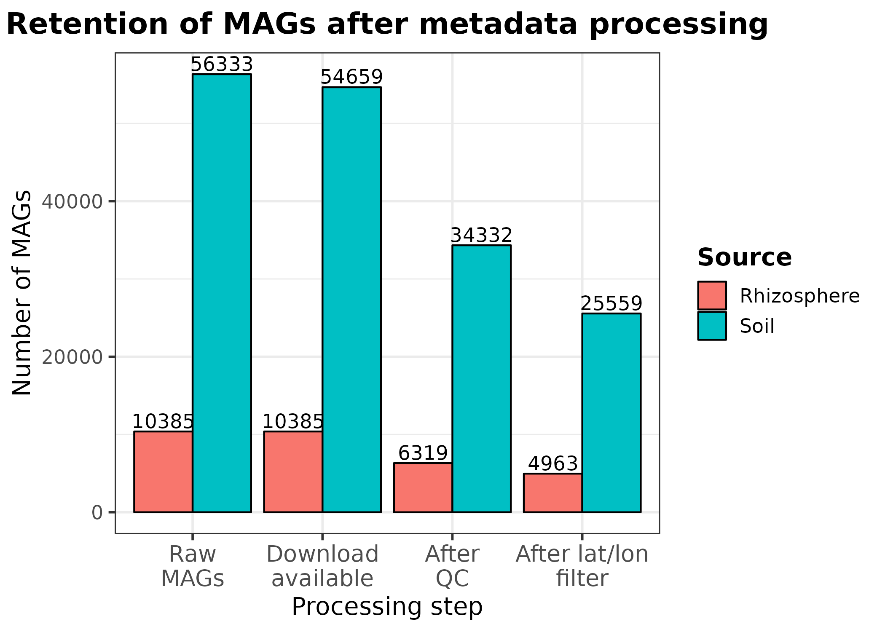
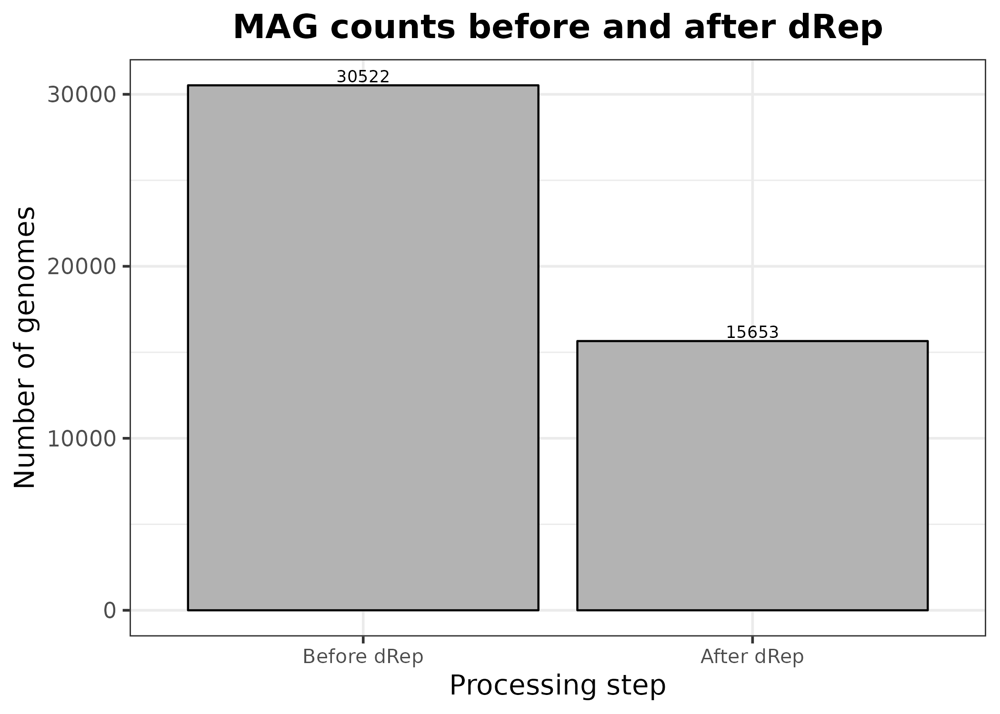
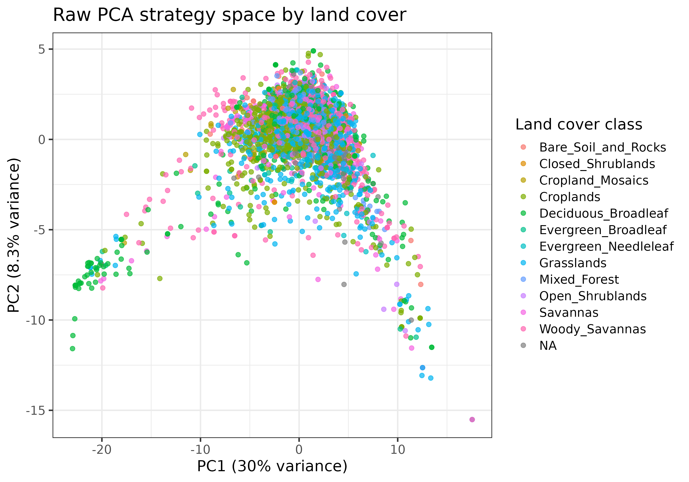
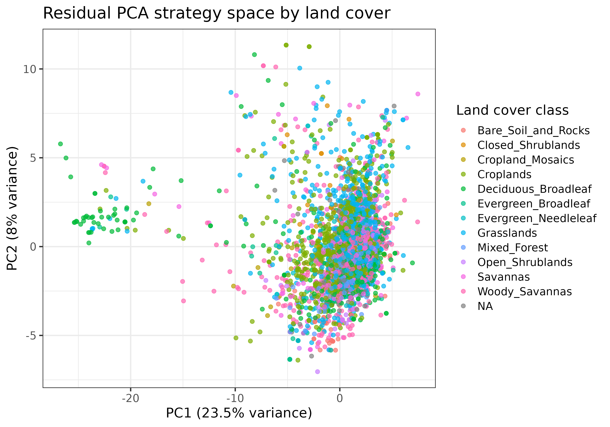
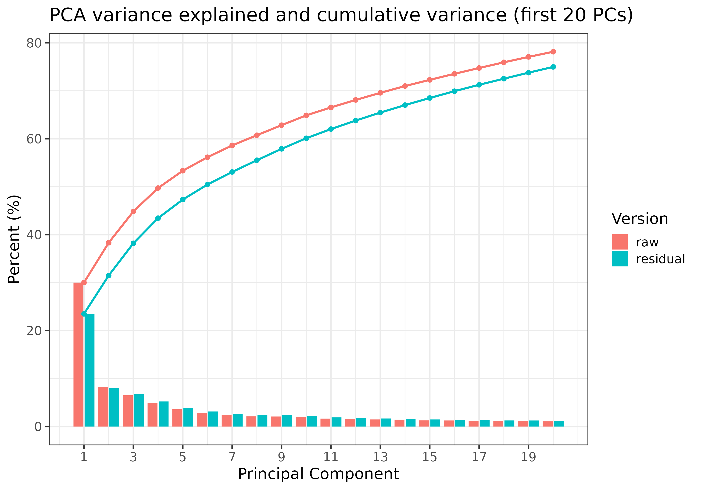

# Integrating Metagenome-Assembled Genome (MAG) Functional Annotations and Environmental Metadata for Downstream Machine Learning Analysis

## Methods
### Data Acquisition
Publicly available MAGs were obtained from Joint Genome Institute Integrated Microbial Genomes & Microbiomes (JGI IMG/M) database (Chen et al. 2022). These MAGs were downloaded in a .fna format along with their associated MAG-level metadata, which encompassed genome quality metrics and sample identifiers that linked the MAGs to their source metagenomes. To study terrestrial MAGs, I obtained 56,333 MAGs from soil and 10,385 MAGs from rhizosphere environments. 

### Preprocess metadata
For downstream analyses, I preprocessed both soil and rhizosphere metadata and merged these records with genome-level metadata to obtain geographic information for subsequent environmental predictor extraction and trait-based analyses. MAG-level metadata were merged with genome-level metadata by their shared metagenome sample ID (`IMG.Genome.ID`). Genome size of each MAG was converted to megabase pairs (Mbp). I then applied genome-quality filtering to retain medium-quality MAGs, defined as having a completeness ≥ 70% and a contamination ≤ 10%. Additionally, because accurate sampling locations are crucial for extracting environmental predictors, I removed MAGs linked to samples with missing geographic coordinates (latitude/longitude). 

### Dereplicate genomes and estimate relative abundance
To reduce redundancy among closely related genomes, I dereplicated these medium-quality MAGs using dRep v3.6.2 (Olm et al. 2017), which assigned each MAG to a secondary cluster at ~95% Average Nucleotide Identity (ANI) and identified a representative "winner" genome per cluster. Using dRep cluster assignments together with MAG average coverage values, I calculated two RA definitions as a sensitivity check. For the representative-genome RA, I retained only dRep “winner” genome per cluster and normalized its average coverage by the total coverage of all representative genomes in the same metagenome sample. For the cluster-level RA, I first summed the average coverage across all MAGs belonging to the same dereplication cluster within a metagenome sample, then normalized cluster totals by the sample-level sum across clusters. In both cases, RA was summed up to 1 per metagenome sample.

### Extract and process broad-scale environmental predictors from global raster products
WorldClim v2.1 (Fick and Hijmans 2017), representing the average from 1970 to 2000, at a 1-km resolution. Evapotranspiration (ET) and Aridity Index (AI) variables were retrieved from Consortium for Spatial Information (CGIAR-CSI) (Zomer et al. 2022) , which models both ET and AI using interpolations provided by WorldClim. 10 soil variables were obtained from the SoilGrids 2.0 (Poggio et al. 2021), which has a 250m resolution.  Seven additional soil variables were obtained at a 1-km resolution from the land-atmosphere interaction research group at Sun Yat-sen University (Shangguan et al. 2014) while the elevation variable was obtained at a 30m resolution from Shuttle Radar Topography Mission (SRTM) (Farr et al. 2007). Both climatic and soil variables underwent reprojection to the EPSG:4326 coordinate system, rescaling, and resampling to a resolution of 1km using the terra package (Hijmans 2022) on RStudio v2024.12.1. The vegetation variables, derived from MODIS remote-sensing products, were subjected to the same reprojection and rescaling steps but utilized GDAL v3.11.0. Enhanced vegetation index (EVI), net primary  was available as monthly composites from 2001 to 2024. I aggregated monthly EVI rasters into annual mean EVI rasters, which were subsequently averaged to calculate a multi-year mean EVI. In contrast, net primary productivity (NPP) and land cover classification were provided as annual products, allowing us to directly compile annual rasters and calculated the multi-year means for each variable. These multi-year means provided time-invariant vegetation predictors that were comparable to other long-term environmental variables extracted. 

### Annotate microbial traits from MAGs
I annotated 192 functional traits from dereplicated MAGs using microTrait (Karaoz and Brodie 2022). Three trait types were generated by microTrait: 112 binary traits, 2 continuous traits, and 78 count-based traits (HMM hit counts). Binary traits were encoded as 0/1 per MAG, continuous traits were retained in their native units, and count traits were normalized by genome size to improve comparability across genomes. These MAG-level trait values were then aggregated to the sample level using community-weighted means (CWM) with dereplication-aware relative abundance weights described above. 

### Trait data pre-processing and exploratory data analysis (EDA)
I preprocessed MAG-level trait outputs to ensure consistency across trait types and comparability across genomes. Specifically, I focused on the trait granularity-3 microTrait outputs, which represented microbial functional traits at the finest level, and used a trait-type mapping table to identify count-like traits, including both count and count-by-substrate traits. I then removed all-zero traits and restricted the analysis to representative genomes retained after dereplication, while linking each representative MAG to its secondary cluster assignment. To reduce the influence of genome size on count-like trait values, I first evaluated genome size associations for a subset of traits and then created two parallel versions of the trait data: a raw version and a genome-size-adjusted version in which count-like traits were residualized against log-transformed genome size. Using the relative abundance (RA) computed above, I then estimated community-weighted means (CWM) of each trait by aggregating MAG-level traits to the metagenome sample level, weighting each MAG or dereplication cluster by its RA within the sample. This resulted in two parallel CWM matrices for downstream analysis: a raw count-like CWM matrix and a residualized count-like CWM matrix. Before ordination, I log-transformed the raw count-like CWM matrix and z-scale standardized both matrix versions so that traits were on comparable scales across samples. I also excluded samples belonging to non-soil land-cover categories prior to downstream analyses.

For EDA, I examined multivariate trait structure using principal component analysis (PCA) on both the raw and residualized sample-level CWM matrices. I compared scree plots, variance explained, PCA score structure, and trait loadings between the two matrix versions to identify interpretable covariance patterns and evaluate the extent to which major trait axes were influenced by genome size. I further summarized the strongest positive and negative trait loadings for the leading PCs and tested the correlation between PC1 and community mean genome size to assess whether the residualization step reduced genome-size-driven structure in the ordination space.

## Results
Based on ecosystem filter results in the metagenome bin portal, 56,333 MAGs were available from soil and 10,385 MAGs from rhizosphere. Metadata preprocessing reduced these totals in a stepwise manner (Figure 1). When I requested a bulk download link for all 56,333 soil MAGs, not all MAGs were available in the package provided by the JGI team. I therefore quantified the number of MAGs retained after restricting the dataset to downloadable genomes. All rhizosphere MAGs were downloadable, but the soil MAGs were slightly reduced to 54,659. The most information lost occurred after medium-quality filtering, leaving 6,319 rhizosphere MAGs and 34,332 soil MAGs. After removing MAGs lacking latitude or longitude information, the final cleaned metadata tables contained 4,963 rhizosphere MAGs and 25,559 soil MAGs.  

**Figure 1.** Retention of rhizosphere and soil MAGs across metadata preprocessing steps. Bars show the number of MAGs remaining after restriction to downloadable MAGs, medium-quality filtering, and removal of records lacking latitude or longitude information.

Rhizosphere and soil MAGs were then combined for downstream analyses. The combined set was dereplicated to reduce redundancy among closely related genomes. The dRep analysis assigned each MAG to a secondary cluster and identified a representative winner genome for each cluster. Dereplication reduced the working set from 30,522 medium-quality MAGs to 15,653 representative genomes (Figure 2).

**Figure 2.** MAG counts before and after dereplication.

Several count-like microTrait traits showed moderate positive correlations with genome size, particularly substrate uptake traits. To reduce the effect of genome size on downstream multivariate structure, I first constructed raw and genome-size-residualized MAG-level trait matrices. After aggregating each matrix to the sample level using community-weighted means (CWM), I performed PCA to compare ordination structure, variance explained, and trait covariance patterns between the raw and residualized datasets. In the raw matrix, PC1 explained 30.0% of the variance, whereas in the residual matrix PC1 explained 23.5%, indicating that genome-size residualization reduced the dominance of the leading axis (Figure 3 and 4). When samples were colored by land-cover class, substantial overlap was observed among classes in both raw and residual ordinations, with little evidence of strong separation along the first two PCs. Variance-explained summaries also showed that the raw matrix retained slightly more cumulative variance in the first several components than the residual matrix (Figure 5). Final ML-ready matrices generated from this workflow are provided in `output/reports/final_project/pca_matrices`. Together, these results suggest that residualization changed the distribution of variance across principal components while preserving broad multivariate trait structure.

**Figure 3.** PCA of the raw sample-level community-weighted mean (CWM) trait matrix. Samples are plotted by PC1 and PC2, with points colored by land-cover class.

**Figure 4.** PCA of the genome-size-residualized sample-level community-weighted mean (CWM) trait matrix. Samples are plotted by PC1 and PC2, with points colored by land-cover class.

**Figure 5.** Variance explained by principal components for the raw and genome-size-residualized sample-level CWM trait matrices. Bars show the proportion of variance explained by each principal component, and lines show cumulative variance explained.

## Discussion
This project established a reproducible workflow for integrating metagenome-assembled genomes (MAGs), microbial trait annotations, and environmental metadata into a data matrix suitable for downstream machine learning analyses. In both my topic proposal and analysis proposal, I framed the project as a pipeline-building effort rather than a final predictive modeling study, with the goal of generating a clean and biologically interpretable trait × environment matrix from publicly available MAG resources. The final results support that goal by showing that quality control, dereplication, trait aggregation, and exploratory ordination are all necessary before downstream modeling can be meaningfully attempted.

Starting from 56,333 soil MAGs and 10,385 rhizosphere MAGs, the working dataset became substantially smaller after restricting to downloadable genomes, applying medium-quality filters, and removing records lacking latitude or longitude information. This finding shows that a large fraction of the apparent data volume in public repositories is not immediately usable for trait–environment analysis without additional quality control and metadata validation. Dereplication revealed substantial genome redundancy among these medium-quality MAGs, suggesting that studying traits at the level of all individual MAGs would overrepresent closely related genomes and inflate the apparent contribution of redundant trait profiles.

A second major result was that genome size influenced the structure of count-like microTrait outputs, particularly substrate uptake traits, and that genome-size adjustment altered the multivariate structure of the resulting sample-level trait matrices. In my proposals, I highlighted the importance of evaluating normalization and transformation choices before downstream ML analysis. The PCA comparison between raw and residualized community-weighted mean (CWM) matrices showed that the raw matrix had a stronger dominant first axis, whereas the residualized matrix distributed variance more evenly across principal components. This suggests that part of the leading structure in the raw ordination was driven by genome-size-related differences rather than only ecological variation in trait composition. At the same time, broad overlap among land-cover classes in both ordinations indicates that the first two principal components did not produce strong discrete separation by land cover, suggesting that the dominant axes instead captured more general multivariate gradients in trait structure.

This project partially covered the full range of exploratory analyses I initially envisioned. In particular, my topic and analysis proposals emphasized trait prevalence, sparsity, and correlation structure as additional diagnostics, whereas the final report focused primarily on preprocessing, dereplication, and PCA-based exploratory analysis. Even so, the project now provides the key ingredients needed for downstream predictive modeling: a cleaned MAG dataset, dereplication-aware abundance estimates, sample-level trait matrices, and matched environmental predictors. In that sense, the final results remain well aligned with the original project goal of creating a standardized and biologically interpretable foundation for future trait–environment modeling in microbial ecology. In future work, I plan to compare ML input matrices built at multiple levels, including MAG-level versus community-weighted mean (CWM) traits, individual traits versus grouped traits, and broader strategy axes derived from approaches such as PCA or Non-negative matrix factorization (NMF). Overall, the final results remain well aligned with the original project goal of creating a standardized and biologically interpretable foundation for future trait–environment modeling in microbial ecology.

## Code and Data Availability
All code used in this project is available in the `final_project` branch of this repository. The main scripts used for metadata preprocessing, dereplication, relative abundance estimation, trait matrix construction, PCA, and environmental predictor extraction are stored in `code/scripts/`. Large raw genome collections and raster files are not redistributed in the repository because of file size and access constraints.

## Scripts Used
**1.** [download_example_genomes.sh](code/scripts/download_example_genomes.sh): Download example bacterial genomes for readers to test run the microtrait pipeline. The second part of the script can generate the id list of rhizosphere MAGs obtained from JGI.

**2.** [prepare_predictors.R](code/scripts/prepare_predictors.R): Explain the ways of retrieving environmental raster products online. It includes processing, resampling, and reprojecting steps. Use dRep outputs and MAG average coverage values to calculate representative-genome and cluster-level relative abundance tables.

**3.** [predictor_data_extraction_RA.R](code/scripts/predictor_data_extraction_RA.R): Preprocess metadata, quality control, remove records lacking latitude/longitude, and write cleaned metadata tables. The predictor extraction parts were done locally.

**4.** [microtrait.example.R](code/scripts/microtrait.example.R): Readers can run the first part to test the microtrait pipeline by submitting it through [run_microtrait.sh](code/scripts/microtrait.example.R). The second part of this script explains the actual step for running microtrait on my project dataset. 

**5.** [prepare_ML_input_matrices.R](code/scripts/prepare_ML_input_matrices.R): Process microTrait trait outputs, construct raw and genome-size-residualized MAG-level trait matrices, aggregate them into sample-level CWM matrices, and perform PCA on raw and residualized sample-level CWM matrices. This script writes ordination plots, variance summaries, and PCA-ready matrices.

## References
Chen I-MA, Chu K, Palaniappan K, Ratner A, Huang J, Huntemann M, Hajek P, Ritter Stephan J, Webb C, Wu D et al. 2022. The IMG/M data management and analysis system v.7: content updates and new features. Nucleic Acids Research 51: D723-D732.

Farr TG, Rosen PA, Caro E, Crippen R, Duren R, Hensley S, Kobrick M, Paller M, Rodriguez E, Roth L et al. 2007. The Shuttle Radar Topography Mission. Reviews of Geophysics 45.

Fick SE, Hijmans RJ. 2017. WorldClim 2: new 1-km spatial resolution climate surfaces for global land areas. International Journal of Climatology 37: 4302-4315.

Hijmans RJ. 2022. terra: Spatial Data Analysis. R package version 1.5-21.

Karaoz U, Brodie EL. 2022. microTrait: A Toolset for a Trait-Based Representation of Microbial Genomes. Frontiers in Bioinformatics Volume 2 - 2022.

Olm MR, Brown CT, Brooks B, Banfield JF. 2017. dRep: a tool for fast and accurate genomic comparisons that enables improved genome recovery from metagenomes through de-replication. The ISME Journal 11: 2864-2868.

